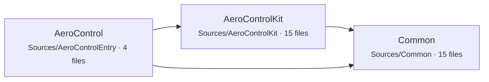
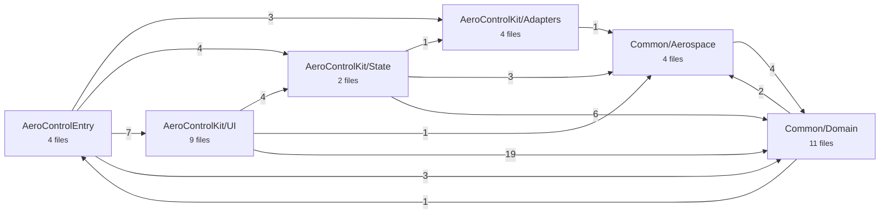
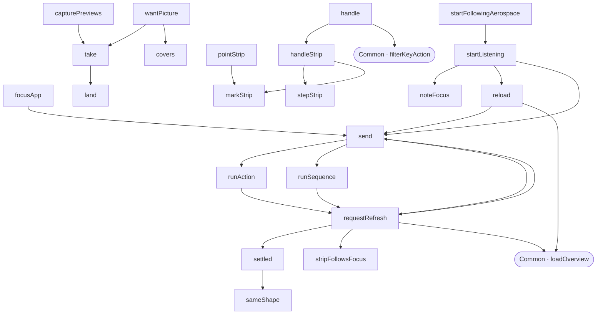
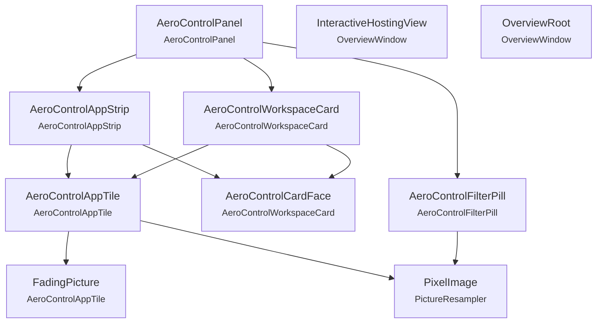

# Architecture, drawn from the code

Generated by `scripts/architecture.py` at every commit, from the Swift sources as they are. Do not edit: change the code, and the drawing follows. A change here in a diff is a change to the architecture. What cannot be read off the code — why a thing is done, in what order a summon proceeds — is in the README and AGENTS.md.

## 1. Targets and files

The package's targets, the files in each with the types they declare, and which target depends on which. `Common` imports nothing of AppKit: the table shows every framework each target reaches for.

| Target | File | Declares |
|---|---|---|
| Common | `Aerospace/AerospaceCliParser.swift` | `CodingKeys`, `DecodedWindow`, `ParsedWindow`, `TolerantInt`, `WorkspaceMonitor` |
| Common | `Aerospace/AerospaceCommands.swift` | `AerospaceCommand` |
| Common | `Aerospace/AerospaceEventParser.swift` | `RawEvent` |
| Common | `Aerospace/AerospaceProcessRunner.swift` | `AerospaceProcessRunner` |
| Common | `Domain/AeroControlAction.swift` | `AeroControlAction` |
| Common | `Domain/AeroControlLayout.swift` | `AeroControlLayout`, `StripCard`, `StripLayout`, `StripPlacement` |
| Common | `Domain/AeroControlMetrics.swift` | `AeroControlMetrics` |
| Common | `Domain/AerospaceEvent.swift` | `AerospaceEvent` |
| Common | `Domain/AppStripModel.swift` | `AppStripModel`, `LegendRow`, `Span` |
| Common | `Domain/CardGrid.swift` | `CardGrid`, `Cell`, `Layout` |
| Common | `Domain/Models.swift` | `Focus`, `OverviewResult`, `WindowInfo`, `WorkspaceInfo` |
| Common | `Domain/OverviewFilter.swift` | `FilterKey`, `FilterKeyAction` |
| Common | `Domain/OverviewUpdate.swift` | `OverviewEffect`, `OverviewInput`, `OverviewModel` |
| Common | `Domain/TilePacker.swift` | `Packed`, `Tile`, `TilePacker` |
| Common | `Domain/WorkspaceTree.swift` | `Axis`, `WorkspaceTree` |
| AeroControlKit | `Adapters/AerospaceSocketRunner.swift` | `AerospaceSocket`, `AerospaceSocketError`, `AerospaceSocketRunner`, `ServerAnswer`, `SocketHandle` |
| AeroControlKit | `Adapters/NativeApiBridge.swift` | `NativeApiBridge` |
| AeroControlKit | `Adapters/NativeApiBridgeAdapter.swift` | `NativeApiBridgeAdapter` |
| AeroControlKit | `Adapters/SingleInstanceGuard.swift` | `SingleInstanceGuard` |
| AeroControlKit | `State/OverviewStore.swift` | `AppSummon`, `OverviewStore`, `Strip` |
| AeroControlKit | `State/Summon.swift` | `Again`, `Summon` |
| AeroControlKit | `UI/AeroControlAppStrip.swift` | `AeroControlAppStrip` |
| AeroControlKit | `UI/AeroControlAppTile.swift` | `AeroControlAppTile`, `FadingPicture` |
| AeroControlKit | `UI/AeroControlFilterPill.swift` | `AeroControlFilterPill`, `StripApp` |
| AeroControlKit | `UI/AeroControlPanel.swift` | `AeroControlPanel` |
| AeroControlKit | `UI/AeroControlTheme.swift` | `AeroControlPalette`, `AeroControlTheme`, `AeroLook`, `AeroLookKey`, `BasePalette` |
| AeroControlKit | `UI/AeroControlWorkspaceCard.swift` | `AeroControlCardFace`, `AeroControlWorkspaceCard` |
| AeroControlKit | `UI/OverviewDragPayload.swift` | `OverviewDragPayload` |
| AeroControlKit | `UI/PictureResampler.swift` | `PixelImage` |
| AeroControlKit | `UI/SettingsStore.swift` | `AnimationSpeed`, `SettingsStore` |
| AeroControl | `AeroControlApp.swift` | `AeroControlApp`, `AppDelegate` |
| AeroControl | `MenuBarController.swift` | `Action`, `MenuBarController` |
| AeroControl | `OverlayWindowManager.swift` | `OverlayWindowManager` |
| AeroControl | `OverviewWindow.swift` | `BackdropBlur`, `InteractiveHostingView`, `OverviewRoot`, `OverviewWindow` |

| Target | Imports from outside the package |
|---|---|
| Common | CoreGraphics, Foundation |
| AeroControlKit | Accelerate, AppKit, CoreGraphics, Darwin, Foundation, OSLog, SwiftUI |
| AeroControl | AppKit, OSLog, SwiftUI |

## 2. Who uses whom

An arrow from a file to another means the first mentions a type the second declares, in code, not in comments. The direction is the direction of knowledge: `Common` knows nothing above it. First by area, with the number of file-to-file uses crossing each arrow; then every file, and what it reaches for.

| File | Uses |
|---|---|
| `AeroControlEntry/AeroControlApp.swift` | `MenuBarController`, `OverlayWindowManager`, `AerospaceSocketRunner`, `NativeApiBridgeAdapter`, `SingleInstanceGuard`, `OverviewStore`, `Summon`, `SettingsStore` |
| `AeroControlEntry/MenuBarController.swift` | `AeroControlTheme`, `SettingsStore` |
| `AeroControlEntry/OverlayWindowManager.swift` | `OverviewWindow`, `OverviewStore`, `Summon`, `AeroControlPanel`, `SettingsStore`, `AeroControlLayout`, `OverviewFilter` |
| `AeroControlEntry/OverviewWindow.swift` | `AeroControlPanel`, `AeroControlTheme`, `OverviewFilter` |
| `AeroControlKit/Adapters/AerospaceSocketRunner.swift` | `AerospaceProcessRunner` |
| `AeroControlKit/Adapters/NativeApiBridge.swift` | — |
| `AeroControlKit/Adapters/NativeApiBridgeAdapter.swift` | `NativeApiBridge` |
| `AeroControlKit/Adapters/SingleInstanceGuard.swift` | — |
| `AeroControlKit/State/OverviewStore.swift` | `NativeApiBridge`, `AerospaceCliParser`, `AerospaceCommands`, `AerospaceProcessRunner`, `AeroControlAction`, `AerospaceEvent`, `AppStripModel`, `Models`, `OverviewFilter`, `OverviewUpdate` |
| `AeroControlKit/State/Summon.swift` | — |
| `AeroControlKit/UI/AeroControlAppStrip.swift` | `OverviewStore`, `AeroControlAppTile`, `AeroControlWorkspaceCard`, `AeroControlLayout`, `AeroControlMetrics`, `AppStripModel`, `Models` |
| `AeroControlKit/UI/AeroControlAppTile.swift` | `OverviewStore`, `OverviewDragPayload`, `PictureResampler`, `AeroControlLayout`, `AeroControlMetrics`, `Models` |
| `AeroControlKit/UI/AeroControlFilterPill.swift` | `AeroControlTheme`, `PictureResampler`, `AppStripModel`, `OverviewUpdate` |
| `AeroControlKit/UI/AeroControlPanel.swift` | `OverviewStore`, `AeroControlAppStrip`, `AeroControlFilterPill`, `AeroControlWorkspaceCard`, `AerospaceCliParser`, `AeroControlLayout`, `AppStripModel`, `CardGrid`, `Models` |
| `AeroControlKit/UI/AeroControlTheme.swift` | — |
| `AeroControlKit/UI/AeroControlWorkspaceCard.swift` | `OverviewStore`, `AeroControlAppTile`, `OverviewDragPayload`, `AeroControlAction`, `AeroControlLayout`, `AeroControlMetrics`, `Models`, `TilePacker` |
| `AeroControlKit/UI/OverviewDragPayload.swift` | — |
| `AeroControlKit/UI/PictureResampler.swift` | `AeroControlMetrics` |
| `AeroControlKit/UI/SettingsStore.swift` | `AeroControlTheme` |
| `Common/Aerospace/AerospaceCliParser.swift` | `AerospaceCommands`, `AerospaceProcessRunner`, `Models`, `WorkspaceTree` |
| `Common/Aerospace/AerospaceCommands.swift` | `AerospaceCliParser`, `AeroControlAction` |
| `Common/Aerospace/AerospaceEventParser.swift` | `AerospaceCliParser`, `AerospaceEvent` |
| `Common/Aerospace/AerospaceProcessRunner.swift` | — |
| `Common/Domain/AeroControlAction.swift` | — |
| `Common/Domain/AeroControlLayout.swift` | `AeroControlMetrics`, `AppStripModel`, `Models`, `TilePacker` |
| `Common/Domain/AeroControlMetrics.swift` | — |
| `Common/Domain/AerospaceEvent.swift` | — |
| `Common/Domain/AppStripModel.swift` | `MenuBarController`, `AerospaceCliParser`, `OverviewFilter` |
| `Common/Domain/CardGrid.swift` | — |
| `Common/Domain/Models.swift` | — |
| `Common/Domain/OverviewFilter.swift` | `AerospaceCliParser`, `Models`, `OverviewUpdate` |
| `Common/Domain/OverviewUpdate.swift` | `AeroControlAction`, `AerospaceEvent`, `Models` |
| `Common/Domain/TilePacker.swift` | — |
| `Common/Domain/WorkspaceTree.swift` | — |

## 3. The vocabularies

The enums the parts speak to each other in. Inputs go into the reducer, effects come out; events are what AeroSpace said, actions are what is asked of it; keys are what the keyboard means, and the summons what a link means.

```mermaid
classDiagram
    class OverviewInput {
        <<OverviewUpdate>>
        loaded(OverviewResult)
        event(AerospaceEvent)
        action(AeroControlAction)
    }
    class OverviewEffect {
        <<OverviewUpdate>>
        windowRemoved(Int)
        refresh
        runAction(AeroControlAction)
        runSequence((AeroControlAction))
    }
    class AerospaceEvent {
        <<AerospaceEvent>>
        focusChanged(windowId: Int?, workspace: String)
        changed
    }
    class AeroControlAction {
        <<AeroControlAction>>
        focusWorkspace(String)
        focusWindow(Int)
        moveWindow(windowId: Int, toWorkspace: String)
        closeWindow(Int)
        moveWindowQuietly(windowId: Int, toWorkspace: String)
        mergeWorkspace(source: String, into: String)
    }
    class FilterKey {
        <<OverviewFilter>>
        character(Character)
        backspace
        enter
        escape
        next
        previous
        home
        end
        commandDigit(Int)
    }
    class FilterKeyAction {
        <<OverviewFilter>>
        none
        setQuery(String)
        focus(windowId: Int)
        handled
    }
    class AppSummon {
        <<OverviewStore>>
        launch
        focus(windowId: Int)
        pick
        none
    }
    class Summon {
        <<Summon>>
        map
        focusedApp
        app(bundleId: String)
    }
    class Again {
        <<Summon>>
        close
        step
        focus(app: String)
    }
    class Action {
        <<AppStripModel>>
        none
        step(Int)
        select(Int)
        commit(Int)
        cancel
    }
```

## 4. The store, method by method

Every method of `OverviewStore` and the methods it calls, with the pure functions of `Common` it reaches. The reducer is a leaf: it is called, it calls nothing back.

Methods that neither call nor are called by another method of the store, so the views and the host call them directly: `clearPreviews`, `dropStrip`, `icon`, `measurePreviews`, `notePointer`, `prepareCapture`, `requestPreviewAccess`, `stop`, `stopFollowingAerospace`, `summonApp`.

## 5. What is sent to AeroSpace

Every command the app can send, from `AerospaceCommands.swift`, and the files that send it. Nothing else talks to AeroSpace.

| Static | AeroSpace command | Sent by |
|---|---|---|
| `listWindows` | `list-windows` | AerospaceCliParser |
| `listWorkspaces` | `list-workspaces` | AerospaceCliParser |
| `listFocusedWindow` | `list-windows` | AerospaceCliParser |
| `listFocusedWorkspace` | `list-workspaces` | AerospaceCliParser |
| `subscribe` | `subscribe` | OverviewStore |
| `focusWorkspace` | `workspace` | argv(for:) |
| `focusWindow` | `focus` | argv(for:) |
| `moveWindowToWorkspace` | `move-node-to-workspace` | argv(for:) |
| `closeWindow` | `close` | argv(for:) |

## 6. The views

Each SwiftUI view and the views it builds.

## 7. The entry layer's seam

What the AppKit side calls on the kit. Everything above this line is windows and events; everything below is the model.

| Entry file | Calls into the kit |
|---|---|
| AeroControlApp | **OverlayWindowManager**: rebuild(), toggleVisibility() **OverviewStore**: requestPreviewAccess(), startListening() |
| MenuBarController | **AeroControlTheme**: all **AnimationSpeed**: allCases **SettingsStore**: backdropOpacities, reset(), setAnimationSpeed(), setAppPicker(), setBackdropOpacity(), setTheme() |
| OverlayWindowManager | **OverviewStore**: capturePreviews(), clearPreviews(), dropStrip(), focusApp(), handle(), measurePreviews(), prepareCapture(), reload(), requestPreviewAccess(), send(), startFollowingAerospace(), stepStrip(), stopFollowingAerospace(), summonApp() |
| OverviewWindow | — |
